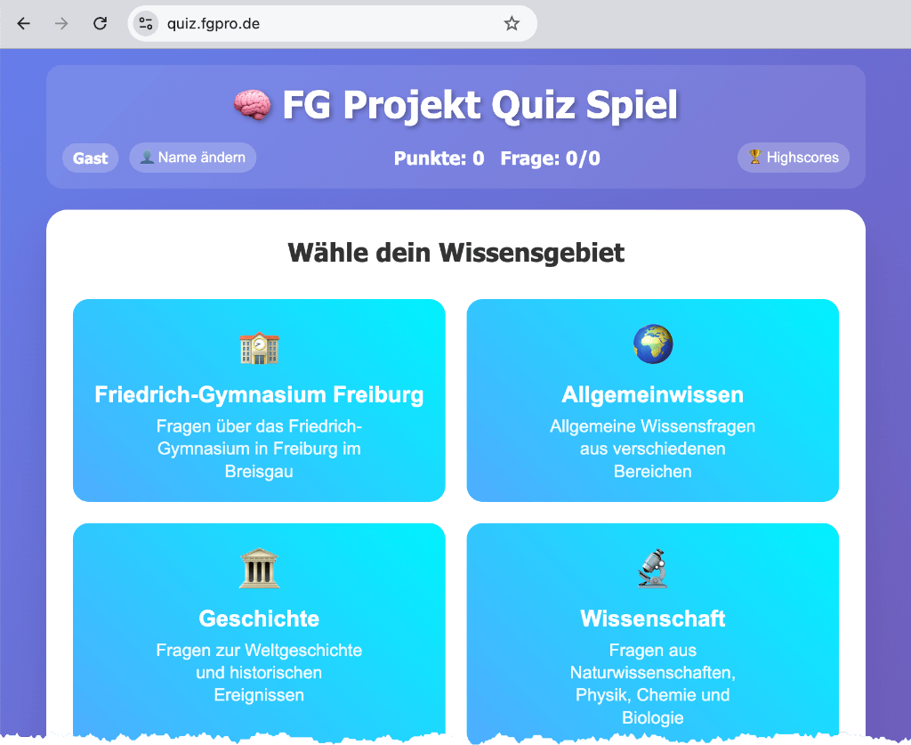

# 🎯 Quiz Spiel - Friedrich-Gymnasium Edition

Ein umfassendes interaktives Quizspiel mit über 682 Fragen in 7 Kategorien, entwickelt mit moderner Server/Client-Architektur.
Das Projekt wurde komplett mit AI Tools entwickelt, es wurde keine Codezeile selbst geschrieben. Verwendet wurde GitHub Copilot
im Agent Mode und Claude Sonnet 4 als LLM. Die Fragen wurden teilweise per ChatGPT erzeugt und ein paar Fragen auch manuell
hinzugefügt.

Das Spiel ist derzeit (Sommer 2025) unter [quiz.fgpro.de](https://quiz.fgpro.de) gehostet.



## ✨ Features

- 🏫 **Friedrich-Gymnasium Kategorie** - Spezielle Fragen zur Schule
- 🧠 **6 Wissenskategorien**
  - Allgemeinwissen
  - Geschichte  
  - Wissenschaft
  - Sport
  - Geografie
  - Kunst & Kultur
- ⏱️ **Timer-System** - Zeitdruck für spannende Quizrunden
- 🎲 **Zufällige Fragenauswahl** - 12 Fragen pro Quiz
- 📱 **Responsive Design** - Funktioniert auf allen Geräten
- 🔄 **Modular erweiterbar** - Einfaches Hinzufügen neuer Kategorien
- 🔄 **Admin Interface** - Einfaches Admin Interface zum Anschauen und runterladen der Game Logs

## 🏗️ Architektur

### Backend (Node.js/Express)
- RESTful API mit Express.js
- Modulares Fragen-Ladesystem
- Session-basierte Quiz-Durchführung
- Sichere Antwort-Validierung
- Dateibasierte Fragenverwaltung mit JSON

### Frontend (Vanilla JavaScript)
- Moderne ES6+ JavaScript ohne Frameworks
- Responsive CSS Grid/Flexbox Layout
- Async/await API-Kommunikation
- Intuitive Benutzeroberfläche
- Loading-Indikatoren und Fehlerbehandlung

## 🚀 Installation und Start

### Voraussetzungen
- Node.js (Version 14 oder höher)
- npm

### Installation
```bash
# Repository klonen
git clone [REPOSITORY_URL]
cd [REPO_DIR]]

# Dependencies installieren
npm install

# Server starten
npm start
```

### Zugriff
- Öffnen Sie http://localhost:3000 in Ihrem Browser
- Das Quiz lädt automatisch alle verfügbaren Kategorien

## 📋 API Endpunkte

### `GET /api/categories`
Gibt alle verfügbaren Quiz-Kategorien mit Metadaten zurück.

**Response:**
```json
{
  "categories": [
    {
      "categoryId": "friedrich-gymnasium",
      "displayName": "Friedrich-Gymnasium Freiburg",
      "description": "Spezielle Fragen rund um das Friedrich-Gymnasium",
      "icon": "🏫",
      "order": 1,
      "questionCount": 12
    },
    {
      "categoryId": "allgemeinwissen", 
      "displayName": "Allgemeinwissen",
      "description": "Fragen aus allen Lebensbereichen",
      "icon": "🧠",
      "order": 2,
      "questionCount": 200
    }
  ]
}
```

### `POST /api/quiz/start`
Startet ein neues Quiz für eine bestimmte Kategorie.

**Request:**
```json
{"category": "allgemeinwissen"}
```

**Response:**
```json
{
  "sessionId": "abc123xyz",
  "totalQuestions": 12,
  "category": "Allgemeinwissen"
}
```

### `GET /api/quiz/:sessionId/question`
Gibt die nächste Frage für eine Session zurück.

**Response:**
```json
{
  "id": 1,
  "question": "Welches ist das größte Säugetier der Welt?",
  "answers": ["Elefant", "Blauwal", "Giraffe", "Nashorn"],
  "questionNumber": 1,
  "totalQuestions": 12
}
  "totalQuestions": 12
}
```

### `POST /api/quiz/:sessionId/answer`
Übermittelt eine Antwort und gibt das Ergebnis zurück.

**Request:**
```json
{"answerIndex": 1}
```

**Response:**
```json
{
  "correct": true,
  "correctAnswer": 1,
  "score": 3,
  "isLastQuestion": false
}
```

### `GET /api/quiz/:sessionId/result`
Gibt das finale Quiz-Ergebnis zurück.

**Response:**
```json
{
  "score": 8,
  "totalQuestions": 12,
  "percentage": 67,
  "category": "Allgemeinwissen",
  "answers": [...]
}
```

### `DELETE /api/quiz/:sessionId`
Beendet eine Quiz-Session.

## 🔐 Admin Interface

Das Admin Interface ist unter `/admin` verfügbar und bietet folgende Funktionen:

### Zugriff
- **URL:** http://localhost:3000/admin
- **Passwort:** `admin123` (konfigurierbar über `ADMIN_PASSWORD`)

### Admin API Endpunkte

#### `POST /admin/login`
Anmeldung am Admin Interface.

**Request:**
```json
{"password": "admin123"}
```

**Response:**
```json
{
  "success": true,
  "token": "abc123xyz..."
}
```

#### `GET /admin/months`
Gibt alle verfügbaren Log-Monate zurück.

**Headers:** `Authorization: Bearer <token>`

**Response:**
```json
{
  "months": ["2025-08", "2025-07", "2025-06"]
}
```

#### `GET /admin/logs/:month`
Gibt die Log-Daten für einen bestimmten Monat zurück.

**Headers:** `Authorization: Bearer <token>`

**Response:**
```json
{
  "logs": [
    {
      "timestamp": "2025-08-01T12:30:45.123Z",
      "username": "TestUser",
      "category": "allgemeinwissen",
      "duration": "127s",
      "score": 10,
      "total": 12,
      "device": "Desktop",
      "userAgent": "Mozilla/5.0..."
    }
  ]
}
```

### Admin Features
- 📊 **Monatliche Statistiken** - Spiele, Erfolgsquote, Durchschnittsdauer
- 📋 **Log-Übersicht** - Tabellarische Darstellung aller Spiele
- 💾 **CSV-Export** - Download der Log-Daten für weitere Analysen
- 🔐 **Passwort-Schutz** - Token-basierte Authentifizierung
- 📱 **Responsive Design** - Funktioniert auf allen Geräten

Weitere Details finden Sie in der [ADMIN.md](ADMIN.md) Dokumentation.

## 🎮 Features

- **6 verschiedene Kategorien**: Allgemeinwissen, Geschichte, Wissenschaft, Sport, Geografie, Kunst & Kultur
- **Sichere API**: Antworten werden serverseitig validiert
- **Session-Management**: Jedes Quiz läuft in einer eigenen Session
- **Zufällige Fragen**: Fragen werden für jede Session neu gemischt
- **Responsive Design**: Funktioniert auf Desktop und Mobile
- **Loading-Indikatoren**: Bessere Benutzererfahrung bei API-Calls
- **Fehlerbehandlung**: Robuste Error-Recovery

## 📁 Projektstruktur

```
quiz-game/
├── server.js                         # Express Server mit API
├── questions-loader.js               # Modulares Fragen-Ladesystem  
├── package.json                      # Node.js Dependencies
├── LOGGING.md                        # Dokumentation des Logging-Systems
├── ADMIN.md                          # Dokumentation des Admin Interfaces
├── public/                           # Client-seitige Dateien
│   ├── index.html                    # HTML Interface
│   ├── styles.css                    # CSS Styles
│   ├── script.js                     # Client JavaScript (QuizGame Klasse)
│   └── admin.html                    # Admin Interface HTML
├── questions/                        # Fragendatenbank (JSON Files)
│   ├── 1_friedrich-gymnasium.json    # Fragen zur Schule
│   ├── 2_allgemeinwissen.json        # Allgemeinwissen-Fragen
│   ├── 3_geschichte.json             # Geschichte-Fragen
│   ├── 4_wissenschaft.json           # Wissenschaft-Fragen
│   ├── 5_sport.json                  # Sport-Fragen
│   ├── 6_geografie.json              # Geografie-Fragen
│   └── 7_kunst.json                  # Kunst & Kultur-Fragen
├── log/                              # Game Logging Verzeichnis
│   ├── game-YYYY-MM.log              # Monatliche Log-Dateien
│   └── game.log.example              # Beispiel-Log-Datei
└── README.md                         # Diese Dokumentation
```

## 🗂️ Fragenverwaltung

### JSON-Struktur
Jede Kategorie-Datei folgt diesem Schema:

```json
{
  "metadata": {
    "categoryId": "allgemeinwissen",
    "displayName": "Allgemeinwissen", 
    "description": "Fragen aus allen Lebensbereichen",
    "icon": "🧠",
    "order": 2
  },
  "questions": [
    {
      "id": 1,
      "question": "Welches ist das größte Säugetier der Welt?",
      "answers": ["Elefant", "Blauwal", "Giraffe", "Nashorn"],
      "correct": 1
    }
  ]
}
```

### Neue Kategorien hinzufügen
1. Neue JSON-Datei im Format `{order}_{categoryId}.json` erstellen
2. Metadata und Fragen-Array definieren
3. Server neu starten - automatisches Laden

## 🔧 Technologien

### Backend
- **Node.js**: JavaScript Runtime
- **Express.js**: Web Framework  
- **File System**: JSON-basierte Fragenspeicherung

### Frontend
- **HTML5**: Semantische Struktur
- **CSS3**: Grid, Flexbox, moderne UI
- **Vanilla JavaScript**: ES6+ Klassen, async/await

## 🛡️ Sicherheit

- Antworten werden nicht an den Client gesendet
- Server-seitige Validierung aller Eingaben
- Session-basierte Zugriffskontrolle
- CORS-Schutz aktiviert

## 🚀 Produktions-Deployment

### Umgebungsvariablen
```bash
PORT=3000                    # Server Port
ADMIN_PASSWORD=admin123      # Admin Interface Passwort (Standard: admin123)
```

### Docker (optional)
```dockerfile
FROM node:18-alpine
WORKDIR /app
COPY package*.json ./
RUN npm ci --only=production
COPY . .
EXPOSE 3000
CMD ["npm", "start"]
```

## � Statistiken

- **Gesamtfragen**: 1.212 Fragen
- **Kategorien**: 7 verschiedene Wissensgebiete
- **Friedrich-Gymnasium**: 12 spezielle Schulfragen
- **Weitere Kategorien**: Je 200 Fragen für maximale Vielfalt
- **Quiz-Länge**: 12 zufällig ausgewählte Fragen pro Durchgang
- **Mögliche Kombinationen**: Über 100 komplett verschiedene Quiz-Durchgänge

## 🛡️ Sicherheit

- Antworten werden nicht an den Client gesendet
- Server-seitige Validierung aller Eingaben  
- Session-basierte Zugriffskontrolle
- Sichere Fragen-ID Verwaltung

## 🚀 Entwicklung

### Lokale Entwicklung
```bash
# Development-Server mit Auto-Reload
npm run dev

# Produktions-Server
npm start
```

### Fragen erweitern
Das Projekt enthält Hilfsskripte für die Fragenerweiterung:
- `extend-allgemeinwissen.js` - Beispiel für Kategorie-Erweiterung
- `extend-all-categories.js` - Massen-Erweiterung aller Kategorien

## 🎯 Zukünftige Erweiterungen

- 🏆 **Highscore-System** - Bestenlisten speichern
- 👥 **Multiplayer-Modus** - Gemeinsam oder gegeneinander spielen  
- 📱 **Progressive Web App** - Offline-Funktionalität
- 🎨 **Themes & Skins** - Anpassbare Oberflächen
- 📈 **Statistiken** - Detaillierte Spieler-Analytics
- 🔊 **Audio-Features** - Sounds und Sprachausgabe

## 📝 Lizenz

Dieses Projekt steht unter der MIT-Lizenz und ist frei verfügbar für persönliche und kommerzielle Nutzung.

## 📊 Performance

- Optimierte API-Calls mit Loading-States
- Minimale Datenübertragung
- Session-basierte Zustandsverwaltung
- Responsive Caching-Strategien

## 🐛 Entwicklung

### Development Mode
```bash
npm run dev  # Startet mit nodemon für Auto-Reload
```

### Debugging
- Server läuft auf Port 3000
- Logs in der Konsole verfügbar
- Browser DevTools für Client-Debugging
